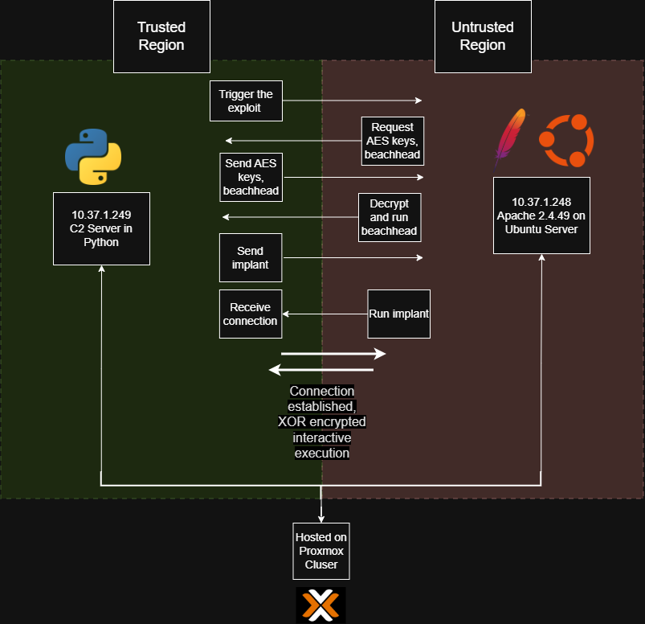

# CS564: Real World Group Final Project

## Project Overview
This project demonstrates how a full cyber-effect pipeline can be built against an Apache server vulnerable to CVE-2021-41773. This CVE allows for path traversal and RCE on an Apache server if cgi-bin scripts are enabled on the server. The vulnerability stems from failing to sanitize 
'.%2e/', more commonly seen as  ../, which navigates to a parent directory. Our project uses the exploit to download and run a beach head. This beach head first performs reconnaisance on the target for privilege escalation vectors, then it performs a privilege escalation to make the user a sudoer. Next, it downloads the C2 implant, adds persistence and runs it. The C2 implant will then receive commands from the C2 server, execute them, and return the outputs to the exfiltration server.
All communication to and from the target machine is encrypted.

## Target Setup Instructions
Refer to `./docs/env-setup-apache2_4_49.md` for how to set up the vulnerable target VM.

## Build/Run Instructions
To run this code:
```bash
sudo python3 trigger.py
```

This script runs all stages of our pipeline, including building and hosting the compiled files as well as launching the C2 server.  

## Architecture
The architecture for this project is as follows: 2 servers are ran by the attacker and a c2 implant runs on the target machine which communicates with both attacker servers. One server is the c2 server which allows the attacker to run commands on the target machine via a command line interface. The other server is the exfiltration server which receives data from the implant. All traffic between these systems is encrypted.  

In order to deploy the implant on a target machine, the exploit chain must be invoked on a vulnerable target. This invokes our two stage exploit chain: exploit -> beachhead -> C2 implant. After the beachhead is downloaded and ran, it performs reconnaisance on the machine and looks for further vulnerabilities. If possible, priviledge escalation is performed to establish persistance for the c2 implant. If not, then the c2 implant is ran normally. The c2 implant and beachhead binaries are implemented with c++ and are stripped. Additionally, unsuspecting filenames are locations are used for the persistent files. The c2 implant is capable of running arbitary commands from the server and carrying out reconnaisance.  

## Threat-Model Diagram


